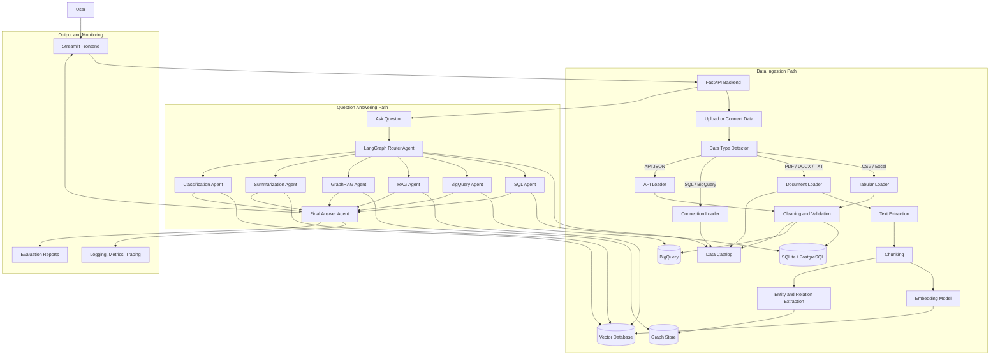

# Healthcare Multi-Source Agentic RAG Platform

## 1. Project Definition

### Problem Statement

Healthcare organizations often store important information across many disconnected sources, including PDF documents, Excel files, CSV datasets, SQL databases, BigQuery tables, and external APIs. Business users, researchers, or analysts may need to answer questions using all of these sources, but they often do not know where the answer is located, how to write SQL, or how to search long documents efficiently.

The goal of this project is to build an AI-powered assistant that allows users to upload or connect multiple data sources and then ask questions in natural language. The system should automatically decide whether the question should be answered using document retrieval, SQL analysis, BigQuery analysis, summarization, GraphRAG, or another tool.

### Customer Request

A healthcare organization wants an assistant that can help non-technical users analyze structured and unstructured data. The customer wants to upload healthcare reports, CSV files, Excel sheets, and connect to SQL or BigQuery data. After that, users should be able to ask questions such as:

```text
What are the main risk factors for patient readmission?

Show the average patient age by diagnosis.

Summarize this clinical policy document.

How are diabetes, obesity, and hypertension related?

Which patients have the highest risk score based on the uploaded dataset?
```

### Use Case

The main use case is a healthcare analytics assistant for clinical researchers, healthcare analysts, or managers. The assistant helps them search documents, summarize reports, analyze tables, and retrieve source-grounded answers without manually writing SQL or reading long files.

---

## 2. Business, Data, Security, AI, Evaluation, Production, and Maintenance Questions

### Business Questions

**Who will use this system?**
The assumed users are healthcare analysts, clinical researchers, managers, and non-technical business users who need answers from healthcare documents and datasets.

**What business problem does the system solve?**
The system reduces manual work required to search documents, analyze spreadsheets, write SQL queries, and combine results from different sources.

**What is the business value?**
The main value is faster decision-making, improved access to information, reduced dependency on technical teams, and better use of existing healthcare data.

**What happens if the system gives an incorrect answer?**
Incorrect answers could lead to wrong interpretation of healthcare data. Therefore, the system must provide source references, confidence indicators, limitations, and should not provide direct medical advice.

### Data Questions

**What types of data are available?**
The system supports structured data such as CSV, Excel, SQL tables, and BigQuery tables, as well as unstructured data such as PDFs, DOCX files, TXT files, and reports.

**Is the data sensitive?**
Healthcare data may contain personally identifiable information or protected health information. For this project, synthetic or public healthcare datasets should be used.

**How often is the data updated?**
For the GitHub version, uploaded files are updated manually. In a production version, database and BigQuery connections could be refreshed on a schedule.

### Security Questions

**How should PII be handled?**
The system should detect and redact sensitive information before sending text to the LLM.

**Should users be authenticated?**
For the MVP, authentication can be optional. For production, authentication and role-based access control should be added.

**How should SQL be secured?**
Only read-only `SELECT` queries should be allowed. Dangerous commands such as `DROP`, `DELETE`, `UPDATE`, `INSERT`, and `ALTER` must be blocked.

### AI Design Questions

**Should this system use RAG or fine-tuning?**
The first version should use RAG because the goal is to answer questions from uploaded documents and data sources. Fine-tuning is not necessary for the MVP.

**Why use agents?**
Agents are useful because the system must decide which tool to use: RAG, SQL, BigQuery, GraphRAG, summarization, or document classification.

**Why use LangGraph?**
LangGraph is useful for building controlled multi-step workflows where each step has a clear state, tool, and decision path.

### Evaluation Questions

**How do we know if the system works well?**
The system should be evaluated using retrieval accuracy, SQL execution success rate, answer factuality, hallucination rate, route accuracy, latency, and cost.

**What does a correct answer mean?**
A correct answer should be relevant, grounded in the right source, factually consistent, and generated using the correct tool or route.

### Production Questions

**Where should the system be deployed?**
The recommended cloud is GCP because the project uses BigQuery and can be deployed easily on Cloud Run. The architecture can also be adapted to AWS or Azure.

**What should be containerized?**
The FastAPI backend, Streamlit frontend, vector database, Redis cache, and local SQL database can be containerized with Docker.

### Maintenance Questions

**Who updates documents and datasets?**
In the MVP, users upload files manually. In production, scheduled ingestion jobs can update data from databases, APIs, and cloud storage.

**How are prompts maintained?**
Prompts should be versioned in files and tracked through a prompt registry.

**How are failures monitored?**
Failures should be tracked through structured logs, traces, metrics, and evaluation reports.

### Final Success Criteria

The project is successful if users can upload documents and datasets, ask natural-language questions, and receive accurate, source-grounded answers. The system should choose the correct route, safely generate SQL, retrieve relevant document chunks, log tool calls, track latency and cost, and be deployable locally and in the cloud.

---

## 3. Data Sources, Data Types, Fields, Loading, Preparation, and Storage

### Supported Data Sources

The system supports multiple input types.

Structured data includes CSV files, Excel files, SQL databases, and BigQuery tables. Unstructured data includes PDFs, DOCX files, TXT files, clinical guidelines, healthcare policies, and reports. API data can also be supported through JSON responses.

### Example Structured Data

A sample `patients.csv` file may include:

```text
patient_id
age
gender
diagnosis
risk_score
province
```

A sample `visits.xlsx` file may include:

```text
visit_id
patient_id
visit_date
provider
department
cost
length_of_stay
```

A sample SQL or BigQuery table may include:

```text
patients
visits
diagnoses
medications
lab_results
claims
```

### Example Unstructured Data

Documents may include:

```text
clinical_guideline.pdf
readmission_policy.pdf
insurance_claim_policy.docx
healthcare_report.txt
```

### Data Loading

CSV and Excel files are loaded with Pandas. SQL databases are accessed with SQLAlchemy. BigQuery is accessed with the Google Cloud BigQuery client. PDFs are loaded with PyPDF or pdfplumber. DOCX files are loaded with python-docx.

### Data Preparation

Structured data is cleaned by handling missing values, standardizing column names, validating schema, removing duplicates, and converting dates. Unstructured documents are processed by extracting text, splitting text into chunks, creating metadata, and generating embeddings.

### Data Storage

Structured data from CSV and Excel is stored in SQLite or PostgreSQL for the local version and optionally uploaded to BigQuery for the cloud version. Documents are stored in file storage, and their text chunks are stored in a vector database such as ChromaDB. Entity relationships extracted from documents are stored in a graph structure such as NetworkX or Neo4j. Metadata about all files and tables is stored in a data catalog.

---

## 4. Complete Platform Architecture and Flows

### Data Ingestion Flow

The first flow happens when the user uploads or connects data.

```text
User uploads CSV / Excel / PDF / DOCX / TXT
or connects SQL / BigQuery
	↓
FastAPI upload or connection endpoint
	↓
Data type detector
	↓
Data loader
	↓
Data cleaner and validator
	↓
Storage decision
	↓
Structured data → SQL database or BigQuery
Documents → Vector database
Relationships → Graph store
Metadata → Data catalog
```

### Question Answering Flow

The second flow happens when the user asks a question.

```text
User asks question
	↓
FastAPI /ask endpoint
	↓
LangGraph Router Agent
	↓
Router checks:
- user question
- data catalog
- available tables
- available documents
- previous conversation context
	↓
Router selects route:
- SQL Agent
- BigQuery Agent
- RAG Agent
- GraphRAG Agent
- Summarization Agent
- Classification Agent
	↓
Selected agent calls tools
	↓
Final Answer Agent formats response
	↓
User receives answer, sources, route, SQL if used, latency, and limitations
```

### Important Clarification

The user question itself is not permanently stored in the vector database. For RAG, the question is temporarily embedded and used to search the vector database. For SQL and BigQuery questions, the question is converted into SQL, validated, executed, and summarized.

---

## 5. Architecture Flowchart

The platform is organized around three paths: data ingestion, question routing, and answer generation. The flowchart below shows how data enters the system, how the router chooses a tool, and how the final answer is produced.



---

## 6. Folder and File Structure

```text
healthcare-multisource-agentic-rag-platform/
│
├── app/
│   ├── main.py
│   ├── routes.py
│   ├── schemas.py
│   ├── config.py
│   └── dependencies.py
│
├── data_sources/
│   ├── csv_loader.py
│   ├── excel_loader.py
│   ├── sql_loader.py
│   ├── bigquery_loader.py
│   ├── api_loader.py
│   └── document_loader.py
│
├── data_pipeline/
│   ├── clean_data.py
│   ├── validate_data.py
│   ├── transform_data.py
│   ├── feature_engineering.py
│   └── feature_engineering.sql
│
├── storage/
│   ├── relational_store.py
│   ├── bigquery_store.py
│   ├── vector_store.py
│   └── graph_store.py
│
├── rag/
│   ├── chunking.py
│   ├── embeddings.py
│   ├── retriever.py
│   ├── reranker.py
│   └── graph_rag.py
│
├── agents/
│   ├── graph.py
│   ├── state.py
│   ├── router.py
│   ├── nodes.py
│   ├── tools.py
│   └── prompts/
│       ├── system_prompt_v1.md
│       ├── system_prompt_v2.md
│       ├── router_prompt.md
│       ├── sql_prompt.md
│       ├── bigquery_prompt.md
│       ├── rag_prompt.md
│       ├── summarization_prompt.md
│       └── safety_prompt.md
│
├── services/
│   ├── llm_service.py
│   ├── prompt_registry.py
│   ├── pii_service.py
│   ├── cache_service.py
│   ├── safety_service.py
│   └── cost_service.py
│
├── evaluation/
│   ├── eval_questions.json
│   ├── evaluate_rag.py
│   ├── evaluate_sql_agent.py
│   ├── evaluate_agent.py
│   ├── hallucination_check.py
│   └── evaluation_report.md
│
├── observability/
│   ├── logging_config.py
│   ├── tracing.py
│   ├── metrics.py
│   └── dashboard_notes.md
│
├── frontend/
│   └── streamlit_app.py
│
├── tests/
│   ├── test_api.py
│   ├── test_loaders.py
│   ├── test_sql_safety.py
│   ├── test_rag.py
│   ├── test_router.py
│   └── test_agent_graph.py
│
├── deployment/
│   ├── Dockerfile
│   ├── docker-compose.yml
│   ├── cloudrun.yaml
│   ├── kubernetes-deployment.yaml
│   └── github_actions.yml
│
├── docs/
│   ├── architecture.md
│   ├── data_sources.md
│   ├── prompt_versioning.md
│   ├── safety_and_pii.md
│   ├── observability.md
│   ├── cost_optimization.md
│   └── deployment.md
│
├── sample_data/
│   ├── patients.csv
│   ├── visits.xlsx
│   └── sample_policy.pdf
│
├── notebooks/
│   └── exploration.ipynb
│
├── README.md
├── requirements.txt
├── .env.example
└── pyproject.toml
```

---

## 7. Agents, Services, and Model Selection

### Router Agent

The Router Agent decides which workflow should answer the user question. It uses the question, the data catalog, available files, available tables, and conversation context. If the question mentions columns, aggregation, counts, averages, or filters, it routes to SQL or BigQuery. If the question refers to documents, policy, guidelines, or explanations, it routes to RAG. If the question asks about relationships between concepts, it routes to GraphRAG.

### SQL Agent

The SQL Agent answers questions from structured local data. CSV and Excel files are converted into SQL tables first. The SQL Agent reads the table schema, generates SQL, validates that it is safe, executes the query, and summarizes the result.

### BigQuery Agent

The BigQuery Agent answers questions from cloud data stored in BigQuery. It reads BigQuery schema, generates BigQuery SQL, estimates query cost, validates the query, executes it, and summarizes the results.

### RAG Agent

The RAG Agent answers questions from documents. It embeds the user question temporarily, searches the vector database, retrieves relevant document chunks, optionally reranks them, and generates an answer with sources.

### GraphRAG Agent

The GraphRAG Agent answers relationship-based questions. It extracts entities from the question, searches a graph of entities and relationships, retrieves supporting document chunks, and generates a relationship-aware answer.

### Summarization Agent

The Summarization Agent summarizes uploaded documents or tables. It can summarize a full document, selected chunks, or a structured table preview.

### Classification Agent

The Classification Agent classifies documents or user questions. For example, it can classify a document as a clinical guideline, policy document, claims report, or research article.

### Final Answer Agent

The Final Answer Agent formats the response. It returns the final answer, route used, tool calls, sources, generated SQL, confidence score, limitations, latency, and cost estimate.

### Recommended Models

For LLM reasoning and answer generation, use GPT-4o-mini or Gemini Flash for a cost-effective portfolio project. For embeddings, use sentence-transformers/all-MiniLM-L6-v2 for a free local version or OpenAI text-embedding-3-small for a cloud version. For reranking, use cross-encoder/ms-marco-MiniLM-L-6-v2. For GraphRAG, use spaCy and NetworkX in the first version.

---

## 8. Deployment Steps

### Step 1: Build Backend API

Create FastAPI endpoints for upload, ask, health check, and metrics.

```text
POST /upload/csv
POST /upload/excel
POST /upload/document
POST /ask
GET /health
GET /metrics
```

### Step 2: Build Local Development Environment

Use Docker Compose to run:

```text
FastAPI backend
Streamlit frontend
PostgreSQL or SQLite
ChromaDB
Redis
```

### Step 3: Containerize the Application

Create a Dockerfile for the backend and optionally another one for the frontend. Use environment variables for API keys and database connections.

### Step 4: Deploy Locally

Run:

```bash
docker-compose up
```

The user should be able to open the Streamlit app, upload files, and ask questions.

### Step 5: Deploy to Cloud

The recommended cloud is GCP. Use Cloud Run for the FastAPI backend, BigQuery for cloud analytics, Cloud Storage for uploaded files, Artifact Registry for Docker images, and Cloud Logging for logs.

### Step 6: Optional AWS and Azure Mapping

The same architecture can be mapped to AWS using Bedrock, S3, ECS, Lambda, CloudWatch, and OpenSearch. It can also be mapped to Azure using Azure OpenAI, Azure Blob Storage, Azure Container Apps, Azure AI Search, and Application Insights.

---

## 9. Evaluation Methods

### RAG Evaluation

RAG should be evaluated using Recall@K, Precision@K, MRR, context relevance, answer relevance, faithfulness, and citation accuracy.

### SQL Evaluation

SQL should be evaluated using SQL validity rate, SQL execution success rate, correct table selection, correct column selection, unsafe SQL blocked rate, and answer correctness.

### Agent Evaluation

The agent workflow should be evaluated using route accuracy, tool selection accuracy, task completion rate, structured output validity, error recovery rate, latency, and cost per request.

### Hallucination Evaluation

The hallucination checker should compare final answers against retrieved chunks or query results. Unsupported claims should be flagged. The hallucination rate should be reported in the evaluation report.

### Prompt Version Evaluation

Prompt versions should be compared using the same evaluation question set. The report should show which prompt version produced better route accuracy, lower hallucination, better SQL validity, and lower cost.

---

## 10. Monitoring and Observability

### Logs

Structured logs should track the request ID, question, route, selected tool, prompt version, model name, generated SQL, retrieved sources, latency, errors, and cost estimate.

### Traces

Tracing should show the full request flow from FastAPI to Router Agent, selected tool, LLM call, vector search, SQL query, BigQuery query, and final response.

### Metrics

Metrics should include request count, error count, average latency, token usage, BigQuery bytes processed, SQL error rate, cache hit rate, retrieval latency, and cost per request.

### Dashboard

The dashboard should show system health, average latency, route distribution, failed queries, prompt injection attempts, PII detections, and average cost.

---

## 11. Recommended Libraries

Use FastAPI, Uvicorn, Pydantic, LangGraph, LangChain, OpenAI or Gemini, Pandas, NumPy, OpenPyXL, SQLAlchemy, google-cloud-bigquery, ChromaDB, sentence-transformers, NetworkX, spaCy, PyPDF, pdfplumber, python-docx, Streamlit, Redis, Presidio, OpenTelemetry, Prometheus, structlog, pytest, and Docker.

---

## 12. Final GitHub README Summary

This project implements a production-style multi-source healthcare AI assistant. Users can upload CSV, Excel, PDF, DOCX, and TXT files or connect SQL and BigQuery data sources. The system stores structured data in SQL or BigQuery, stores document embeddings in a vector database, stores relationships in a graph store, and records all metadata in a data catalog. When the user asks a question, a LangGraph Router Agent decides whether to use SQL, BigQuery, RAG, GraphRAG, summarization, or classification. The system returns source-grounded answers with tool traces, generated SQL, citations, latency, cost, and limitations. The project demonstrates end-to-end LLM development, agentic workflows, RAG, GraphRAG, cloud deployment, evaluation, observability, safety, and healthcare domain expertise.
